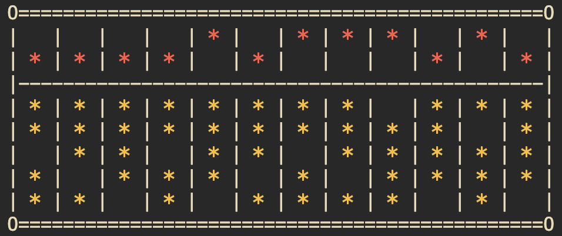

# Homework 01 使用說明

[](../readme.md)

> 國立臺灣師範大學
> 設計學系四年級
> 鄭翔元
> 40768033T

## 如何建立此檔案？

### 一、事前準備

> 若未完成會報錯，請特別注意

1. 請準備 `hw01.c`, `hw02.c` 作為側資放入
2. 如果沒有可以從 `test` 資料夾中拿取，將檔案拉出至 `40768033T` 的資料夾中

### 二、編譯程式步驟（Compile & Build）

1. 打開 terminal
2. 用 `cd` 切換目錄至 `40768033T` 的資料夾下
3. 在此下 `make` 的指令

### 三、刪除執行檔方式

1. 打開 terminal
2. 用 `cd` 切換目錄至 `40768033T` 的資料夾下
3. 在此下 `make clean` 的指令

## 程式碼的內容與功能

### 一、我的 String 函式庫（基本上功能與 `string.h` 的內容相同）

> 相關程式碼： mystring.h, mystring.c, hw01.c

#### 1. Find Character in String

``` c
char mystrchr(const char *string, int character);
```

| 項目  | 內容                                                                                   |
| :---: | -------------------------------------------------------------------------------------- |
| 功能  | 放入一個字串 `string` ，會找出字串中第一個出現 character 的地方（沒有則會回傳 `null`） |
| 限制  | 字串 `string` 需為合法字串，句尾必須是 `\0`                                            |
| 作法  | 從字串頭掃描一次至字串尾，找到即回傳，沒有找到則回傳 `null`                            |

#### 2. (Reversed.) Find Character in String

```c
char mystrrchr(const char *string, int character)
```

| 項目  | 內容                                                                                            |
| :---: | ----------------------------------------------------------------------------------------------- |
| 功能  | 放入一個字串 `string` ，會找出字串中最後一個出現 character 的地方（沒有則會回傳 `null`）        |
| 限制  | 字串 `string` 需為合法字串，句尾必須是 `\0`                                                     |
| 作法  | 從字串頭掃描一次至字串尾，找到就記錄在 `result` 當中（覆蓋前一次找到的位置），最後回傳 `result` |

#### 3. Find Span of Characters

```c
size_t mystrspn(const char *string, const char *accept)
```

| 項目  | 內容                                                                                           |
| :---: | ---------------------------------------------------------------------------------------------- |
| 功能  | 放入一個字串 `string` ，會找出字串中第一個出現非 `accept` 字串中的字元，他的相對位置（數字）） |
| 限制  | 字串 `string`, `accept` 需為合法字串，且內容會需要是 ASCII 代碼可表示的字元                    |
| 作法  | 製作一個 ASCII 字典表，將 `accept` 全部標注起來，再來對應字串查閱字典                          |

#### 4.Find Span of Characters (Converse)

```c
size_t mystrcspn(char *string, char *reject)
```

| 項目  | 內容                                                                                         |
| :---: | -------------------------------------------------------------------------------------------- |
| 功能  | 放入一個字串 `string` ，會找出字串中第一個出現 `reject` 字串中的字元，他的相對位置（數字）） |
| 限制  | 字串 `string`, `reject` 需為合法字串，且內容會需要是 ASCII 代碼可表示的字元                  |
| 作法  | 製作一個 ASCII 字典表，將 `reject` 全部標注起來，再來對應字串查閱字典                        |

#### 5. Find the Pointer where String is Broken by Characters

```c
char *mystrpbrk(const char *string, const char *accept)
```

| 項目  | 內容                                                                        |
| :---: | --------------------------------------------------------------------------- |
| 功能  | 放入一個字串 `string` ，會找出字串中第一個出現 `accept` 的記憶體位置        |
| 限制  | 字串 `string`, `accept` 需為合法字串，且內容會需要是 ASCII 代碼可表示的字元 |
| 作法  | 改造並使用 `mystrcspn`  就完成了                                            |

#### 6. String in another String?

```c
char *mystrstr(const char *haystack, const char *needle)
```

| 項目  | 內容                                                                                            |
| :---: | ----------------------------------------------------------------------------------------------- |
| 功能  | 放入一個字串 `haystack` ，會找出字串 `needle` 是否存在，如果存在即回傳位置，不存在則回傳 `NULL` |
| 限制  | 字串 `haystack`, `needle` 需為合法字串                                                          |
| 作法  | 使用雙重迴圈去找每一個字元點是否為 `needle` 的起始點                                            |

#### 7. String Tokenize

```c
char *mystrtok(char *string, const char *delimiter)
```

| 項目  | 內容                                                                                                                                                                                                                            |
| :---: | ------------------------------------------------------------------------------------------------------------------------------------------------------------------------------------------------------------------------------- |
| 功能  | 放入一個字串 `string` ，將字串用 `delimiter` 所有的元素分割後，所取出的第一段片段，並將第二段片段存入 `glob_Ptr` 中。如果呼叫時 `string` 是 `Null`，則會取用 `glob_Ptr` 繼續做分割（同樣回傳第一段，並將第二段存回 `glob_Ptr`） |
| 限制  | 字串 `string`, `delimiter` 需為合法字串                                                                                                                                                                                         |
| 作法  | 使用 function `patch` 去找單一個 `string` 字元是否與 `delimeter` 相等，以此找到第一段終點。再者，利用 `patch` 找出接下來的字元有無與 `delimeter` 不同，以此作為第二段起點。而當中相等的內容將以 `\0` 覆蓋取代                   |

### 二、String Insert 功能

> 相關程式碼： insert.h, insert.c, hw02.c

#### 函式內容

``` c
int32_t strinsert(char **ppResult, const char *pStr1, int32_t location, const char *pStr2)
```

#### 參數說明

- **ppResult**：存放組合之後的新字串指標位置，程式會宣告一個字串並取代原本的字串指標。
- **pStr1**：原本的字串內容。
- **pStr2**：欲插入的字串內容。
- **location**： `pStr2` 插入 `pStr1` 的位置

- 回傳值：0，代表函式執行成功。

- 注意事項：請勿將 `pStr1` 與 `ppResult` 代入相同字串，會得到錯誤的結果。

### 三、Abacus 算盤模擬器



> 算盤顯示示意圖

#### 程式主要功能（Main Function）

1. 結構： **sAbucas**

    ``` c
    typedef struct _sAbucas sAbucas;
    ```

    提供以下子屬性供使用者設定：

   - **number**：算盤長度（行數）
   - **pUpperRod\[number\]**：算盤每行上面那排的珠子， 1 代表往下撥動、 0 代表往上撥動。
   - **pLowerRod\[number\]**：算盤每行下面那排的珠子，數字代表被往上撥動幾顆珠子（範圍： 0 到 4 顆）。

2. 設定、初始化算盤（數字字串 → 算盤）

    ``` c
    int32_t abacus_set(sAbacus *ptrAbacus, char *strNumber)
    ```

3. 算盤加法（相加）

    ``` c
    int32_t abacus_add(sAbacus *result, sAbacus origin, sAbacus add)
    ```

4. 算盤減法（相減）

    ``` c
    int32_t abacus_del(sAbacus *result, sAbacus origin, sAbacus del)
    ```

5. 印出算盤

    ``` c
    int32_t abacus_print(sAbacus Abacus)
    ```

6. 還原數值（算盤 → 數字字串）

    ``` c
    char *abacus_getNumber(sAbacus Abacus)
    ```

#### 程式內部函式（Internal Function）

## 開發日誌

- 2023/03/13 完成「 一、我的 String 函式庫 」
- 2023/03/14 完成「 二、String Insert 功能 」

---


