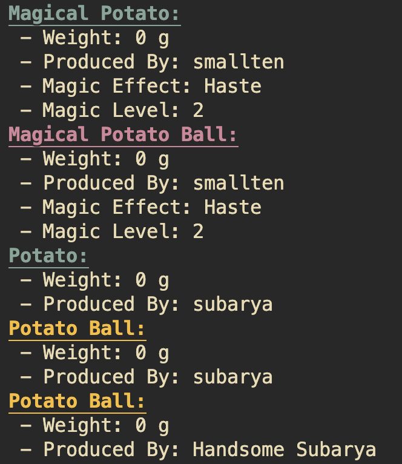

# Homework 01

```txt
國立臺灣師範大學 設計學系四年級 鄭翔元 40768033T
```

[](../readme.md)


## 如何建立此檔案？

### 一、事前準備

> 若未完成會報錯，請特別注意

1. 請準備 `hw01.c`, `hw02.c` 作為側資放入
2. 如果沒有可以從 `test` 資料夾中拿取，將檔案拉出至 `40768033T` 的資料夾中

### 二、編譯程式步驟（Compile & Build）

1. 打開 terminal
2. 用 `cd` 切換目錄至 `40768033T` 的資料夾下
3. 在此下 `make` 的指令

### 三、刪除執行檔方式

1. 打開 terminal
2. 用 `cd` 切換目錄至 `40768033T` 的資料夾下
3. 在此下 `make clean` 的指令

## 程式碼的內容與功能

### 一、我的 String 函式庫（基本上功能與 `string.h` 的內容相同）

> 相關程式碼： mystring.h, mystring.c, hw0101.c

#### 1. Find Character in String

``` c
char mystrchr(const char *string, int character);
```

| 項目  | 內容                                                                                   |
| :---: | -------------------------------------------------------------------------------------- |
| 功能  | 放入一個字串 `string` ，會找出字串中第一個出現 character 的地方（沒有則會回傳 `null`） |
| 限制  | 字串 `string` 需為合法字串，句尾必須是 `\0`                                            |
| 作法  | 從字串頭掃描一次至字串尾，找到即回傳，沒有找到則回傳 `null`                            |

#### 2. (Reversed.) Find Character in String

```c
char mystrrchr(const char *string, int character)
```

| 項目  | 內容                                                                                            |
| :---: | ----------------------------------------------------------------------------------------------- |
| 功能  | 放入一個字串 `string` ，會找出字串中最後一個出現 character 的地方（沒有則會回傳 `null`）        |
| 限制  | 字串 `string` 需為合法字串，句尾必須是 `\0`                                                     |
| 作法  | 從字串頭掃描一次至字串尾，找到就記錄在 `result` 當中（覆蓋前一次找到的位置），最後回傳 `result` |

#### 3. Find Span of Characters

```c
size_t mystrspn(const char *string, const char *accept)
```

| 項目  | 內容                                                                                           |
| :---: | ---------------------------------------------------------------------------------------------- |
| 功能  | 放入一個字串 `string` ，會找出字串中第一個出現非 `accept` 字串中的字元，他的相對位置（數字）） |
| 限制  | 字串 `string`, `accept` 需為合法字串，且內容會需要是 ASCII 代碼可表示的字元                    |
| 作法  | 製作一個 ASCII 字典表，將 `accept` 全部標注起來，再來對應字串查閱字典                          |

#### 4.Find Span of Characters (Converse)

```c
size_t mystrcspn(char *string, char *reject)
```

| 項目  | 內容                                                                                         |
| :---: | -------------------------------------------------------------------------------------------- |
| 功能  | 放入一個字串 `string` ，會找出字串中第一個出現 `reject` 字串中的字元，他的相對位置（數字）） |
| 限制  | 字串 `string`, `reject` 需為合法字串，且內容會需要是 ASCII 代碼可表示的字元                  |
| 作法  | 製作一個 ASCII 字典表，將 `reject` 全部標注起來，再來對應字串查閱字典                        |

#### 5. Find the Pointer where String is Broken by Characters

```c
char *mystrpbrk(const char *string, const char *accept)
```

| 項目  | 內容                                                                        |
| :---: | --------------------------------------------------------------------------- |
| 功能  | 放入一個字串 `string` ，會找出字串中第一個出現 `accept` 的記憶體位置        |
| 限制  | 字串 `string`, `accept` 需為合法字串，且內容會需要是 ASCII 代碼可表示的字元 |
| 作法  | 改造並使用 `mystrcspn`  就完成了                                            |

#### 6. String in another String?

```c
char *mystrstr(const char *haystack, const char *needle)
```

| 項目  | 內容                                                                                            |
| :---: | ----------------------------------------------------------------------------------------------- |
| 功能  | 放入一個字串 `haystack` ，會找出字串 `needle` 是否存在，如果存在即回傳位置，不存在則回傳 `NULL` |
| 限制  | 字串 `haystack`, `needle` 需為合法字串                                                          |
| 作法  | 使用雙重迴圈去找每一個字元點是否為 `needle` 的起始點                                            |

#### 7. String Tokenize

```c
char *mystrtok(char *string, const char *delimiter)
```

| 項目  | 內容                                                                                                                                                                                                                            |
| :---: | ------------------------------------------------------------------------------------------------------------------------------------------------------------------------------------------------------------------------------- |
| 功能  | 放入一個字串 `string` ，將字串用 `delimiter` 所有的元素分割後，所取出的第一段片段，並將第二段片段存入 `glob_Ptr` 中。如果呼叫時 `string` 是 `Null`，則會取用 `glob_Ptr` 繼續做分割（同樣回傳第一段，並將第二段存回 `glob_Ptr`） |
| 限制  | 字串 `string`, `delimiter` 需為合法字串                                                                                                                                                                                         |
| 作法  | 使用 function `patch` 去找單一個 `string` 字元是否與 `delimeter` 相等，以此找到第一段終點。再者，利用 `patch` 找出接下來的字元有無與 `delimeter` 不同，以此作為第二段起點。而當中相等的內容將以 `\0` 覆蓋取代                   |

### 二、String Insert 功能

> 相關程式碼： insert.h, insert.c, hw0102.c

#### 函式內容

``` c
int32_t strinsert(char **ppResult, const char *pStr1, int32_t location, const char *pStr2)
```

#### 參數說明

- **ppResult**：存放組合之後的新字串指標位置，程式會宣告一個字串並取代原本的字串指標。
- **pStr1**：原本的字串內容。
- **pStr2**：欲插入的字串內容。
- **location**： `pStr2` 插入 `pStr1` 的位置

- 回傳值：0，代表函式執行成功。

- 注意事項：請勿將 `pStr1` 與 `ppResult` 代入相同字串，會得到錯誤的結果。

### 三、Abacus 算盤模擬器

> 相關程式碼： abacus.h, abacus.c, hw0103.c

#### 程式主要功能（Main Function）

> 有寫入 `abacus.h` ，使用者可以 `#include` 使用之函式方法

1. **結構： sAbucas**

    ``` c
    typedef struct _sAbucas sAbucas;
    ```

    提供以下子屬性供使用者設定：

   - **number**：算盤長度（行數）
   - **pUpperRod\[number\]**：算盤每行上面那排的珠子， 1 代表往下撥動、 0 代表往上撥動。
   - **pLowerRod\[number\]**：算盤每行下面那排的珠子，數字代表被往上撥動幾顆珠子（範圍： 0 到 4 顆）。

2. **初始化 ＆ 回收算盤**

   > 注意：每次宣告新的算盤指標前，請務必使用 `abacus_init`
   > ；而在不使用時務必使用 `abacus_free` 回收，以免發生錯誤。

    ``` c
    sAbacus *abacus_init(void)  // 初始化算盤
    void abacus_free(sAbacus *Abacus)   // 回收算盤
    ```

    函式功能概要

    - 動態宣告記憶體空間： `malloc` 與 `free` 算盤指標
    - 設定預設值：0
    - 預設算盤行數：1（亦有進行空間宣告： `malloc` 與 `free` ）
    - 宣告後可直接進行運算使用（視為算盤數值 = 0）

    例外情形

    - 當使用者帶入 `null` 值進入 `abacus_free` 時，將不會進行任何操作
    - 若將尚未 `malloc` 的指標帶入，可能會產生記憶體錯誤的問題發生 `segmentation fault`

3. **設定算盤數值內容**

   > 使用此功能會重新分配記憶體空間大小，請務必完成 **2.初始化** 再使用

    ``` c
    int32_t abacus_set(sAbacus *ptrAbacus, char *strNumber)
    ```

    函式功能概要

    - 使用 `realloc` 重新分配算盤欄數
    - 將 `char*` 字串轉為 `0~9` 數字之後再以算盤表示
    - 程式結束後，回傳 `0` 表示執行成功

    例外情形

    - 輸入負數、小數或任何帶有非法字元之內容，將回傳 `-1`
    - 輸入數字內容位數 `> 255` 或 `0` ，不符合行數限制，回傳 `-1`
    - 若輸入數字為 0 開頭（例如： `00255` `00033` ）將視為非法輸入，回傳 `-1`

4. **算盤加法運算**

    ``` c
    int32_t abacus_add(sAbacus *result, sAbacus origin, sAbacus add)
    ```

    函式功能概要

    - 將兩個算盤數字相加，並存入複寫至第三個算盤當中
    - 程式的實踐方式為使用大數加法（大略分為以下步驟）：
      1. 將算盤內容轉為數字字串
      2. 進行兩個數字字串相加
      3. 將相加結果字串轉為算盤帶入 `result` 中

    - 其中， c. 步驟使用 `abacus_set` 實踐，有相依性請務必注意。

    例外情形

    - 算盤必須先完成 `abacus_init` ，否則若檢測到 `null` 將回傳 `-1`
    - 若算盤資訊與實際內容不符合（例如：算盤陣列 `pUpperRod` 長度 `25` ，但算盤行數 `row` 為 10），將回傳 `-1` 不予計算
    - 若算盤儲存數值不符合規範（例如：`pUpperRod[2] = 6` ），將回傳 `-1` 不予計算

5. **算盤減法運算**

    ``` c
    int32_t abacus_del(sAbacus *result, sAbacus origin, sAbacus del)
    ```

    函式功能概要

    - 將兩個算盤數字相減，並存入複寫至第三個算盤當中
    - 程式的實踐方式為使用大數減法（大略分為以下步驟）：
      1. 將算盤內容轉為數字字串
      2. 進行兩個數字字串相減
      3. 將相加結果字串轉為算盤帶入 `result` 中

    - 其中， c. 步驟使用 `abacus_set` 實踐，有相依性請務必注意。

    例外情形

    - 算盤必須先完成 `abacus_init` ，否則若檢測到 `null` 將回傳 `-1`
    - 若算盤資訊與實際內容不符合（例如：算盤陣列 `pUpperRod` 長度 `25` ，但算盤行數 `row` 為 10），將回傳 `-1` 不予計算
    - 若算盤儲存數值不符合規範（例如：`pUpperRod[2] = 6` ），將回傳 `-1` 不予計算
    - 若被減數 < 減數（即 `origin < del` ），計算結果 `<0` 的情況下，將回傳 `-1` 不予計算

6. **印出算盤**

    ``` c
    int32_t abacus_print(sAbacus Abacus)
    ```

    

    函式功能概要

    - 將算盤印出在終端機上，十分美觀
    - 根據行數，僅印出與數值相符的位數
    - 數值 `0` 的情況下，將印出一行為 `0` 的情況

    例外情形

    - 算盤必須先完成 `abacus_init` ，否則若檢測到 `null` 將回傳 `-1`
    - 若算盤資訊與實際內容不符合（例如：算盤陣列 `pUpperRod` 長度 `25` ，但算盤行數 `row` 為 10），將回傳 `-1`
    - 若算盤儲存數值不符合規範（例如：`pUpperRod[2] = 6` ），將回傳 `-1`

7. **還原算盤數值**

    ``` c
    char *abacus_str(sAbacus sA)
    ```

    函式功能概要

    - 將算盤內容還原為「文字字串」
    - 為大數加法、大數減法、印出算盤之函式引用，勿輕易移除

    例外情形

    - 算盤必須先完成 `abacus_init` ，否則若檢測到 `null` 將回傳 `null`
    - 若算盤資訊與實際內容不符合（例如：算盤陣列 `pUpperRod` 長度 `25` ，但算盤行數 `row` 為 10），將回傳 `null`
    - 若算盤儲存數值不符合規範（例如：`pUpperRod[2] = 6` ），將回傳 `null`

#### 程式內部函式（Internal Function）

> 無法引用，沒有寫在 `abacus.h` 中，僅供 `abacus.c` 維護人員參考

1. **將單字轉為數字 `0~9`**

    ```c
    int16_t to_int(char ltr)
    ```

2. **將數字 `0~9` 轉為單字**

    ```c
    int16_t to_int(char ltr)
    ```

3. **計算算盤第 `idx` 行的數值，同時確認該行算盤合法性**

    ```c
    int8_t abacus_col(sAbacus sA, uint8_t idx)
    ```

4. **檢測整個算盤內容是否合法**

    ```c
    int8_t abacus_check(sAbacus sA)
    ```

5. **比較兩個算盤誰大誰小**

    ```c
    int8_t abacus_sort(sAbacus **ppA_bg, sAbacus **ppA_sm)
    ```

### 四、Json 轉換查詢器

> 相關程式碼： hw0104.c

#### 結構、巨集定義

1. **Json 格式**

    > 用來記錄每項物件在冒號右方（內容）為何種格式

    ```c
    typedef enum {
        json_obj = 0,  // Object
        json_str = 1,  // String
        json_bol = 2,  // Boolean
        json_int = 3,  // Integer
        json_frc = 4,  // Fraction
    } json_type;
    ```

2. **指令文字**

    > 用來辨識輸入文字中的特殊符號，並轉為指令進行操作

    ```c
    typedef enum {
    NEXT = 1,    // 當偵測到  ,
    ASSIGN = 2,  // 當偵測到  :
    VALUE = 3,   // 當偵測到  1234567890TFtf
    STRING = 4,  // 當偵測到  "
    OBJECT = 5,  // 當偵測到  {
    ARRAY = 6,   // 當偵測到  [
    } str_cmd;
    ```

3. **Json 儲存結構**

    > 使用 `Object : Key` 的方式儲存標頭與內容，相互串接

    ```c
    typedef struct _obj_* pObj;
    typedef struct _key_*pKey;

    // Object 結構
    typedef struct _obj_ {
        char* name;     // 名稱
        bool isArray;   // 資料 ( Key )是否為陣列
        pKey Data;      // 資料內容 ( Key )
        pObj Next;      // 下一個物件
    } sObj;

    // Key 結構
    typedef struct _key_ {
        json_type type; // 資料 Json 型別
        char* str;      // ( 文字型別 )      儲存字串
        bool neg;       // ( 數字、小數型別 ) 記錄內容是否為負值
        int64_t num;    // ( 數字型別 )      儲存數字
        int64_t frac;   // ( 數字、小數型別 ) 儲存小數點後數字 ※ 整數部分會放在 num
        bool is;        // ( 布林型別 )      紀錄 True, False
        pObj Obj;       // ( 物件型別 )      連結到子物件標頭
        pKey Next;      // 如果資料為陣列形式，將以 Linked Node 連結
    } sKey;
    ```

    **結構圖像化示例**

    

    對應以下程式碼：

    ```json
        "Main" : {
            "id": "7we4235jdws",
            "index": [123353432, 124314]
        }
    ```

#### Json 儲存功能

1. 新增 `node`

    ```c
    pObj newObj();
    pKey newKey();
    ```

2. 讀取、判斷是否為該指令

    ```c
    bool isNextCmd(char** ppStr, str_cmd cmd);
    ```

    - 偵測字串中下個 `str_cmd` 所列之字元的位置：

      - 大括弧： `{` `}`
      - 中括弧： `[` `]`
      - 冒號： `:`
      - 逗號： `,`
      - 數字、布林值： `1234567890` `.` `-` `TFtf`
      - 引號、文字匡： `"`

    - 根據輸入指令，會進行判斷是否為該字元

        > 本程式無完整偵測 Json 錯誤功能，
        > 但保留此一特性可偵測下一指令是否為「應該」出現的指令，
        > 若不符合的話可回傳錯誤訊息

    - 執行完成後，文字指標會移動至目標字元的下一個字元位置

3. 存入數字、文字內容

    ```c
    char* parseWord(char** ppStr);
    void parseNum(char** ppStr, pKey nodeKey);
    ```

    - 將字串內容中的文字與數字提取出來，觸發條件：

      1. `Parse Number` ：由引號之後出現 `-1234567890TFtf` 觸發
      2. `Parse String` ：由出現 `“` 觸發

    - 其中 `ParseWord` 需自行選擇存放為「標頭文字」或「內容文字」
    - 執行完成後，文字指標會移動至存取內容的下一個字元位置

4. 存入物件、陣列

    ```c
    pObj parseObj(char** ppStr);
    void parseArray(char** ppStr, pObj object);
    ```

    - 將整個物件、陣列的內容製作成 Linked List 保存起來，觸發條件：

      1. `Parse Array` ：偵測到 `[]` 之後觸發
      2. `Parse Number` ：偵測到 `{}` 之後觸發

    - 兩隻程式為遞迴交雜形式，可重複遞迴演算存入「物件中的陣列」、「鎮列中的物件」、「物件中的物件中的陣列的物件」之類的內容
    - 由於 Json 進入點不固定，可能為「陣列」或是「物件」，故必須於 `main` 函式手動先做判斷，決定執行哪一程式進行遞迴
    - 輸出值為一個 `Object Node` ，作為整個 Json 的 `Header Node`

5. 釋放儲存空間

    ```c
    void freeNode(pObj headNode)
    ```

    - 釋放所有生成的 `Object Pointer` `Key Pointer`

#### Json 查找功能

1. Linked List 尋找器

    ```c
    pKey searchKey(const pObj head, const char* keyStr)
    ```

    功能特性

    - 輸入一字串 `keyStr`，可以找出 `Json` 中該 `Object` 的屬性內容（回傳 `keyNode`）
    - 輸入方式與 `Object` 格式相同，例如： `Friends[2].address.Phone[1]`
    - 若找不到該項目，則回傳 `null`

    實作原理

    - 使用 `strtok` 以 `.` 分割字串
    - 偵測每段字串是否包含 `[` `]`
    - 尋找該層 `node` 是否有相同名稱之物件
    - 如果有陣列，使用 `Next` 推移至指定位置
    - 如此反覆，往下尋找

2. Key Node 打印器

    ```c
    void printValue(const pKey value, bool isArray)
    void printObj(const pObj object)
    ```

    - 核心概念：
      - `Print Value` 負責打印 `:` 以右的內容
      - `Print Object` 負責打印 `:` 以左的標頭

    - 由於 Array 的資訊儲存在 Object Node 當中，無法由 Key Node 得知，故 `Print Value` 需額外傳入 `isArray` 以判斷是否運算整行 Key Node List 或僅需要印製該 Node 即可

#### 操作方式

1. 根據提示，輸入一個合法的 Json 字串

    - 多餘空白是可以接受的
    - 字串請務必使用 `"` 匡起來
    - 括弧請務必兩兩成對
    - 不可以於 Json 中出現換行字元（因為使用 `fgets` 讀取資訊，會因為接收到 `\n` 而中斷讀取）

2. 進入搜尋頁面，輸入 1 開始搜尋、輸入 2 結束程序

3. 輸入欲查詢之項目名稱，內容可以是以下的形式：

    | 項目                     | 內容             |
    | ----------------------- | --------------- |
    | `Name`                   | 單純字串         |
    | `Name[3]`                | 字串帶陣列項目   |
    | `Name.first`             | 字串物件內容     |
    | `Name[3].first[2].ID[3]` | 更多更複雜的形式 |

4. 找到即回傳對應內容，找不到會回傳 `(null)`

### 五、Json 轉換查詢器

> 相關程式碼： oop.h, oop.c, hw0105.c

#### ~~一隻不太好玩的地瓜球模擬程式~~

#### 程式結構

1. **初始化：建立兩位人物**

    ```c
    struct PotatoProducer smallten, subarya;
    init_smallten(&smallten);
    init_subarya(&subarya);
    ```

    建立並開始串接 `Structure` 裡面的各項功能

2. **地瓜球製造者**

    ```c
    struct PotatoProducer {
    struct Potato *(*produce)(const struct PotatoProducer *);
    char name[32];
    };
    ```

    1. `name` ：存放「製造者名稱」
    2. `produce()` ：可以根據「製造者」自定義 `Produce` 會生產出什麼樣的「地瓜」(回傳值：`Struct Potato`)

3. **地瓜屬性與功能**

    ```c
    struct Potato {
    void (*print)(const struct Potato *);
    // Destruct potato and turn it into potato ball
    struct PotatoBall *(*fry)(struct Potato **);
    int32_t weight;
    const char *producer_name;
    };
    ```

    1. `producer_name` ：存放「製造者名稱」（與製造者資訊同步，製造者改名也會跟著改）

        > 備註：只取記憶體位置的意思

    2. `weight` ：紀錄生產出來的「地瓜」，他的重量資訊（隨機產生）

    3. `print()` ：將「地瓜」的「生產履歷與資訊」給印出來
    4. `fry()` ：根據「地瓜」不同，可以定義不同「炸的過程」產生不同的「地瓜球」(回傳值： `Struct Potato` )，同時會將「地瓜」給消耗（進行程序： `free(Potato)` ）

4. **地瓜球屬性與功能**

    ```c
    struct PotatoBall {
    void (*print)(const struct PotatoBall *);
    void (*dtor)(struct PotatoBall **);
    const char *producer_name;
    int32_t weight;
    };
    ```

    1. `producer_name` ：存放「製造者名稱」（與製造者資訊同步，製造者改名也會跟著改）

        > 備註：只取記憶體位置的意思

    2. `weight` ：從「地瓜」獲得的「地瓜球」重量資訊

    3. `print()` ：將「地瓜球」的「生產履歷與資訊」給印出來
    4. `dtor()` ：將「地瓜」給刪除 or 消耗（進行程序： `free(Potato)` ），應該是模擬「地瓜球」被吃掉的情況

#### 功能操作

只要先建立好 `PotatoProducer`

便可以透過兩個模組功能，建立起一套地瓜球物件了

**目前一共有兩套模組：**

1. Subarya - 普通地瓜球生產小農

    ```c
    init_subarya(&subarya);
    ```

2. Smallten - 來自魔法世界的地瓜球大佬

    ```c
    init_smallten(&smallten);
    ```

另外，魔法世界有額外的「地瓜」以及「地瓜球」屬性

```c
struct MagicalPotato {
    struct Potato base;
    enum MagicalEffect effect;
    int effect_level;
};
```

1. `Magic Effect` 魔法效果
2. `Effect Level` 效果等級

目前在輸出上，不同角色生產出來的地瓜球會是不同顏色：

像是魔法世界是「紫色地瓜球」、一般世界是「黃色地瓜球」

會像這樣顯示在你的螢幕上喔～



---


